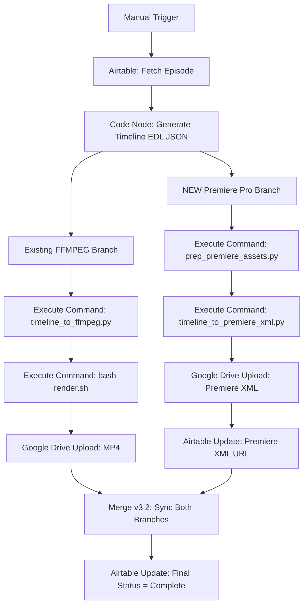

# n8n BowTie Master Orchestrator Extension Spec — T014

**Task**: T014 [US1] Design n8n BowTie Master Orchestrator extension spec
**Agent**: Builder (spec only — no deployment)
**Date**: 2026-02-14
**Status**: Draft

---

## Overview

This spec extends the existing BowTie Master Orchestrator n8n workflow with a **parallel branch** for Premiere Pro XML generation. After the Timeline EDL JSON Code node produces the timeline, a new branch runs asset preparation and XML generation in parallel with the existing FFMPEG render branch. Both branches synchronize via a Merge v3.2 node before the final Airtable status update.

**This is a design spec only.** Builder writes the spec. User deploys to the live n8n instance. User tests. Per CLAUDE.md: "n8n: Local workflow JSON is USELESS. If it's not deployed, it doesn't exist."

---

## Architecture

### Current Flow (unchanged)

```
Manual Trigger → Airtable Fetch (Episode) → Code Node (Timeline EDL JSON) → Execute Command (timeline_to_ffmpeg.py) → Execute Command (bash render.sh) → Google Drive Upload (MP4) → Airtable Update (Video URL + status)
```

### Extended Flow (new parallel branch)



---

## Node Specifications

### Node 1: Execute Command — `prep_premiere_assets.py`

| Property | Value |
|----------|-------|
| Type | `n8n-nodes-base.executeCommand` |
| Name | `Prep Premiere Assets` |
| Command | `python3 /home/node/scripts/shared/prep_premiere_assets.py "{{$json.timeline_json_path}}" --output "/tmp/premiere-prep/{{$json.episode_id}}" --base-path "{{$json.asset_base_path}}"` |
| Working Directory | `/home/node/scripts/shared/` |
| Timeout | `60000` (60s) |

**Input**: Receives timeline JSON file path and episode metadata from the upstream Code node.

**Output**: Creates the 6-folder bin structure (`01-Video/`, `02-VO/`, `03-SFX/`, `04-Music/`, `05-Grade/`, `06-Export/`) with all assets copied/linked. Passes the prep output path downstream.

---

### Node 2: Execute Command — `timeline_to_premiere_xml.py`

| Property | Value |
|----------|-------|
| Type | `n8n-nodes-base.executeCommand` |
| Name | `Generate Premiere XML` |
| Command | `python3 /home/node/scripts/shared/timeline_to_premiere_xml.py "{{$json.timeline_json_path}}" --base-path "/tmp/premiere-prep/{{$json.episode_id}}" -o "/tmp/premiere-prep/{{$json.episode_id}}/06-Export/{{$json.episode_id}}-rough-cut.xml"` |
| Working Directory | `/home/node/scripts/shared/` |
| Timeout | `30000` (30s) |

**Input**: Timeline JSON path + prep folder path from Node 1.

**Output**: xmeml v4 XML file at the specified output path. Passes the XML file path downstream.

---

### Node 3: Google Drive Upload — Premiere XML

| Property | Value |
|----------|-------|
| Type | `n8n-nodes-base.googleDrive` |
| Name | `Upload Premiere XML to Drive` |
| Operation | `upload` |
| Credential | Google Drive OAuth: **`53ssDoT9mG1Dtejj`** |
| File Name | `{{$json.episode_id}}-rough-cut.xml` |
| Parent Folder | Episode subfolder under BowTie Bullies Root (`1JVHhmZLK3Rv2pK3W4ZlfYkF6xdeW1a2p`) → `video/` subfolder |
| Input Binary Field | Read from file path output of Node 2 |

**Note**: The upload target folder ID should be resolved dynamically from the episode's existing Drive folder structure (already created per episode during pipeline setup). Use the pattern: `EP-XXX > video/`.

**Output**: Google Drive file ID and shareable URL for the uploaded XML.

---

### Node 4: Airtable Update — Premiere XML URL

| Property | Value |
|----------|-------|
| Type | `n8n-nodes-base.airtable` |
| Name | `Update Episode: Premiere XML URL` |
| Operation | `update` |
| Credential | Airtable PAT: **`YCWFwTIXwnTpVy2y`** |
| Base ID | `appTO7OCRB2XbAlak` |
| Table ID | `tblh3Mrp7HhQ4wPQ5` (Episodes) |
| Record ID | `{{$json.episode_record_id}}` (from upstream Airtable Fetch) |
| Fields to Update | `Premiere XML URL`: `https://drive.google.com/file/d/{{$json.drive_file_id}}/view` |
| | `Premiere Prep Path`: `/tmp/premiere-prep/{{$json.episode_id}}` |

**Prerequisite**: T015 must be completed first — the two new fields (`Premiere XML URL`, `Premiere Prep Path`) must exist on the Episodes table before this node can write to them.

---

### Node 5: Merge v3.2 — Sync FFMPEG + Premiere Branches

| Property | Value |
|----------|-------|
| Type | `n8n-nodes-base.merge` |
| Version | `3.2` |
| Name | `Sync FFMPEG + Premiere` |
| Mode | `append` |
| Number of Inputs | `2` |

**Purpose**: Waits for BOTH the existing FFMPEG branch (ending at Google Drive Upload MP4) AND the new Premiere branch (ending at Airtable Update Premiere XML URL) to complete before firing the downstream final status update.

**Per shared-learnings (2026-02-09)**: NEVER connect multiple parallel branches to the same input index of a downstream node. n8n fires on first arrival, not when all arrive. The Merge node with `mode: "append"` and `numberInputs: 2` ensures both branches complete before proceeding.

**Connections**:
- Input 0: Output of the last node in the FFMPEG branch (Google Drive Upload MP4)
- Input 1: Output of Node 4 (Airtable Update Premiere XML URL)
- Output: Connects to the final Airtable status update node

---

### Node 6: Airtable Update — Final Status

| Property | Value |
|----------|-------|
| Type | `n8n-nodes-base.airtable` |
| Name | `Update Episode: Pipeline Complete` |
| Credential | Airtable PAT: **`YCWFwTIXwnTpVy2y`** |
| Operation | `update` |
| Record ID | `{{$json.episode_record_id}}` |
| Fields | `Pipeline Status`: `Complete` |

**Note**: This node replaces the existing final status update. The existing one should be disconnected from the FFMPEG branch and reconnected after the Merge node instead.

---

## Deployment Instructions (for User)

### Step 1: Update Workflow via API (NEVER overwrite)

Per shared-learnings (2026-02-12): **ALWAYS** `GET` the live workflow first, patch specific node parameters, then `PUT` back. **NEVER** push local JSON blindly.

```
1. GET /workflows/{workflow_id} — fetch current live state
2. Add the 5 new nodes (Nodes 1-5 above) to the nodes array
3. Add connections from the Timeline EDL Code node to Node 1
4. Add connections: Node 1 → Node 2 → Node 3 → Node 4 → Merge input 1
5. Reconnect existing FFMPEG branch final node → Merge input 0
6. Connect Merge output → Node 6 (final status)
7. Disconnect old final status node from FFMPEG branch
8. PUT /workflows/{workflow_id} with ONLY: name, nodes, connections, settings
```

**Payload must only include**: `name`, `nodes`, `connections`, `settings`. Extra fields like `tags`, `pinData`, `staticData` cause 400 errors.

### Step 2: Verify Prerequisites

- [ ] T015 complete: `Premiere XML URL` and `Premiere Prep Path` fields exist on Episodes table
- [ ] `prep_premiere_assets.py` deployed to n8n server at `/home/node/scripts/shared/`
- [ ] `timeline_to_premiere_xml.py` deployed to n8n server at `/home/node/scripts/shared/`
- [ ] `BowTie-Grade.cube` available at expected path for prep script to copy into `05-Grade/`

### Step 3: User Tests

User runs the workflow manually for one episode and verifies:
1. Premiere prep folder created with correct structure
2. XML file generated and uploads to Google Drive
3. Episodes record updated with Premiere XML URL
4. Merge node waits for both branches before final status update
5. XML imports into Premiere Pro without errors

---

## Dependencies

| Dependency | Task | Status |
|------------|------|--------|
| `prep_premiere_assets.py` script | T006 | Required |
| `timeline_to_premiere_xml.py` script | T005 | Required |
| Airtable Episodes field additions | T015 | Required |
| `BowTie-Grade.cube` LUT file | T005.5 | Required |
| Existing FFMPEG branch functional | Pre-existing | Assumed |

---

## Risk Notes

- **Script path on n8n server**: The Execute Command nodes assume scripts are at `/home/node/scripts/shared/`. Confirm the actual deployment path on the n8n server before configuring.
- **Temp file cleanup**: `/tmp/premiere-prep/` will accumulate per episode. Consider adding a cleanup step or documenting manual cleanup in the SOP.
- **Drive folder resolution**: Node 3 needs the episode's Drive `video/` subfolder ID. This may need a Google Drive "list children" step or the folder ID passed through from the upstream Airtable fetch. Confirm the episode record contains the Drive folder ID.
- **Binary data handling**: If the XML file needs to be read as binary for Drive upload, use the Execute Command node's stdout or a subsequent "Read Binary File" node. Per shared-learnings: in database mode, binary data in `$binary.data.data` is a reference ID, not actual base64.
