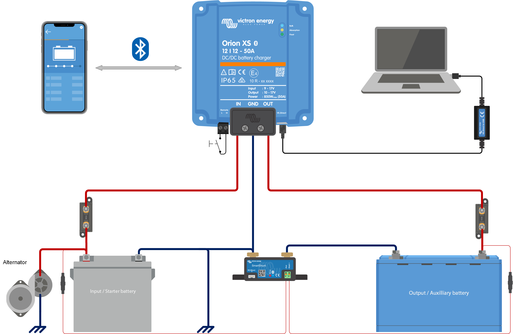
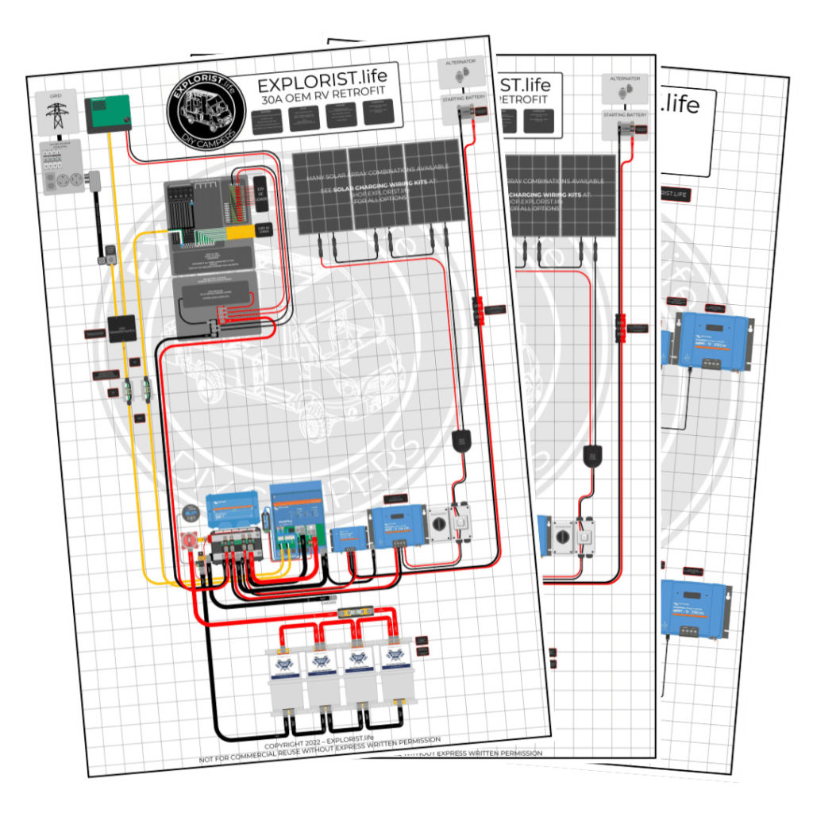

# Victron Orion XS 50A DC-DC Charger → Lynx Distributor Installation Guide
## For 2021 Chevy Silverado

> **This is a research reference document, not a code implementation plan.**
> Compiled from Victron official docs, community forums, and installer guides.

---

## Reference Diagrams

### Victron Official — Orion XS Charger Mode Wiring

*Source: Victron Energy official documentation*

### EXPLORIST.life — Full System with Orion XS + Lynx

*Source: EXPLORIST.life 30A OEM RV Retrofit diagram (preview resolution)*

---

## 1. System Overview — Connection Flow

```
┌─────────────────────┐
│  2021 Silverado      │
│  Starter Battery     │
│  (under hood)        │
└─────┬───────┬───────┘
      │(+)    │(-)
      │       │
   60-70A   Same gauge as (+)
   MEGA     dedicated negative
   fuse     wire (recommended)
      │       │
      │       │        ← 4AWG if run is 5-10m (16-33ft)
      │       │        ← 6AWG if run is under 5m (16ft)
      │       │
┌─────▼───────▼───────┐
│   Victron Orion XS   │   Mount NEAR house battery
│   12/12-50A DC-DC    │   (vertical, terminals down)
│   Charger            │   10cm clearance all sides
└─────┬───────┬───────┘
      │(+)    │(-)
      │       │
   Lynx fuse  Lynx negative
   slot (60A  busbar
   MEGA)
      │       │
┌─────▼───────▼───────┐
│   Lynx Distributor   │
│   (4-slot fused      │
│    busbar)           │
└─────┬───────┬───────┘
      │       │
      ▼       ▼
   House Battery (LiFePO4)
   connected to LEFT side
   (unfused) of Lynx system
```

---

## 2. Grounding / Negative Wiring — The Big Decision

### Option A: Dedicated Negative Wire (RECOMMENDED by Victron)

**What:** Run a separate negative wire from Orion XS input back to the starter battery negative terminal, same gauge as the positive wire.

**Pros:**
- Matches Victron's official wiring diagrams
- Cleaner circuit — current path is fully defined
- Eliminates ambiguity about chassis resistance

**Cons:**
- Extra wire to run through firewall
- Cost of additional 4AWG/6AWG run

### Option B: Chassis Ground Only

**What:** Ground the Orion XS input negative to the truck chassis (bare metal, paint scraped).

**Pros:**
- Simpler install — one less wire through firewall
- The truck chassis IS designed as a ground conductor

**Cons:**
- Ground loop risk: Community measurements show ~40A ground loop current during engine cranking when both starter and house batteries share chassis ground
- Only ~2A actually uses the dedicated negative wire when both chassis and dedicated wire are connected — the chassis takes almost all the return current
- Some modern trucks have current sensors on the starter battery negative terminal; bypassing them can confuse the truck's battery management

### Recommendation for Your Silverado

**Use a dedicated negative wire.** The 2021 Silverado has an intelligent charging system. Running the Orion XS input negative directly to the starter battery negative terminal (not chassis) ensures the truck's BMS sees the current draw properly. Use the same gauge wire as your positive run.

**Output side:** The Orion XS output negative connects to the Lynx Distributor negative busbar → which connects to house battery negative. This is separate from the input/vehicle side.

### Ground Loop Prevention Rules
1. Do NOT connect Orion input negative to both chassis AND starter battery — pick one (starter battery terminal preferred)
2. House battery system ground (via Lynx) should have ONE chassis bond point
3. Keep input and output ground paths electrically separate through the Orion XS

---

## 3. Firewall Routing — 2021 Silverado Specific

### Primary Option: Factory Grommet (Driver's Side)

**Location:** Under the hood, driver's side, there is a large rubber grommet where the main wiring harness passes through. It exits inside the cab above the fuse box area, roughly where your left foot sits.

**Method:**
1. From inside the cab, locate the grommet behind the kick panel (driver's side)
2. Use a sharp pick or awl to puncture the grommet to one side of existing wires
3. Feed your 4AWG wire through from engine bay side
4. Seal with RTV silicone or a proper grommet insert to maintain water seal

**Why driver's side:** The main harness grommet is under the brake master cylinder area — it's the largest and easiest to work with.

### Alternative Option: Passenger Side

Some installers drill a new ~1.5" hole on the passenger side of the firewall (near where passenger feet rest). This avoids disturbing factory wiring but requires:
- A proper step drill or hole saw
- A rubber grommet to protect wire from sharp metal edges
- RTV sealant

### Routing from Cab to Bed

After entering the cab through the firewall, route the wire:
1. Under the carpet along the rocker panel
2. Through the rear wall of the cab or under the bed
3. Some Silverado owners route through the gap between the cab and bed (accessible by removing rear seat)

### Critical Safety Notes
- **Always use a grommet or edge protector** where wire passes through metal — sharp edges will cut through insulation over time from vibration
- **Apply dielectric grease** to any connection point near the firewall
- **Secure the wire** with zip ties or adhesive clips every 12-18 inches to prevent chafing

---

## 4. Lynx Distributor Fuse Layout

The Lynx Distributor has **4 MEGA fuse slots** on the positive busbar, plus unfused connections on the left side.

### Recommended Fuse Position Assignment

```
┌─────────────────────────────────────────────────────┐
│                  LYNX DISTRIBUTOR                     │
│                                                       │
│  LEFT SIDE          FUSE SLOTS (1-4)                 │
│  (unfused)     ┌────┬────┬────┬────┐                │
│                │ F1 │ F2 │ F3 │ F4 │                │
│  ┌──────┐     ├────┼────┼────┼────┤                │
│  │BATTERY│    │60A │60A │XXA │XXA │  ← MEGA fuses  │
│  │(+)(-)│     └────┴────┴────┴────┘                │
│  └──────┘       │    │    │    │                     │
│                 │    │    │    │                     │
│              Orion Inv/ Solar  12V                   │
│              XS   Chgr  MPPT  Fuse                  │
│              DC-DC      Ctrl  Block                  │
└─────────────────────────────────────────────────────┘
```

| Fuse Slot | Component | MEGA Fuse Size | Wire Gauge |
|-----------|-----------|---------------|------------|
| **F1** | Orion XS 50A DC-DC | **60A** | 4AWG or 6AWG |
| **F2** | Inverter/Charger | Size per inverter spec | Per inverter manual |
| **F3** | Solar MPPT Controller | Per controller label | Per controller manual |
| **F4** | 12V DC Fuse Block | Based on total load | Appropriate gauge |
| **Left (unfused)** | **House Battery** | No fuse — direct | 4/0 or 2/0 AWG |

### Key Rules
- **Battery ALWAYS connects to the LEFT (unfused) side** of the Lynx system
- **All loads and chargers** go on fused positions (right side)
- Use **MEGA fuses** (bolt-down type) — they come in 60A, 80A, 100A, 125A, 150A, 200A, 250A, 300A sizes
- **Place dummy fuses in unused slots** to prevent the red warning LED from illuminating
- Name each fuse in the **VictronConnect app** (max 16 characters per name)
- Tighten all connections: **14 Nm for M8 model**, 33 Nm for M10 model
- Cable lugs must be **M8 ring terminals** (or M10 for the M10 model)

### Physical Installation Notes
- Mount sequence on each post: **cable lug → washer → spring washer → nut**
- Fuses go in first, cables on top
- Access negative terminals by swinging black cable separators upward
- Remove separator posts if wire diameter exceeds 10mm

---

## 5. Alternator Protection & Input Current Limiting

### Your Silverado's Alternator

The 2021 Silverado 1500 comes with either a **170A alternator** (4.3L V6) or a **250A alternator** (5.3L/6.2L V8). Check your specific engine — this determines your safe draw limit.

### The 40% Rule

**Best practice: limit Orion XS input current to no more than 40% of your alternator's rated output.** This leaves headroom for the truck's own electrical demands (ECU, lights, A/C, etc.).

| Your Alternator | 40% Limit | Recommended Orion XS Input Setting |
|-----------------|-----------|-------------------------------------|
| 170A (V6) | 68A | **50A** (already under limit — run full) |
| 250A (V8) | 100A | **50A** (already well under limit — run full) |

For a single Orion XS 50A on a Silverado, **you're safely within the 40% threshold on any engine option.** You can run the full 50A input current without alternator stress.

If you later add a second Orion XS (100A total draw), you'd want to limit each to ~40A on the 250A alternator, or ~30A each on the 170A.

### Smart Alternator / Engine Detection Settings

The 2021 Silverado uses a **smart alternator** with variable voltage output. In VictronConnect, configure:

| Setting | Smart Alternator Default | Adjust If Needed |
|---------|------------------------|------------------|
| **Alternator Type** | Smart alternator | Select this |
| **Start Voltage (Vstart)** | 14.0V | Triggers immediate charging |
| **Delayed Start Voltage** | 13.3V | Allows charging after 120s at this lower voltage |
| **Shutdown Voltage** | 13.1V | Engine-off detection (1 min delay) |
| **Input Voltage Lock-out (shutdown)** | 12.5V | Prevents draining starter battery |
| **Input Voltage Lock-out (restart)** | 12.8V | Resumes when starter recovers |

**If charging is unreliable:** Smart alternators sometimes float at lower voltages. Try reducing Start Voltage to **13.7V** and Shutdown Voltage to **12.8V**.

### How Alternator Protection Actually Works

The Orion XS does **not** have a direct current sensor on the input. It protects the alternator through **voltage-based regulation**:

1. You set the **input current limit** (1A–50A, adjustable in 0.1A increments)
2. If the starter battery voltage drops below thresholds, the Orion automatically reduces output current
3. If voltage hits the lock-out threshold (12.5V default), it shuts down entirely
4. This prevents the Orion from draining the starter battery even under heavy load

### Conservative Start Recommendation

For your first drive after install:
1. Set input current to **35A** initially
2. Monitor starter battery voltage in VictronConnect while driving
3. If voltage stays above 13.5V under load, bump to **40A**, then **45A**, then **50A**
4. Find the sweet spot where the alternator holds voltage comfortably

---

## 6. Orion XS Configuration (VictronConnect App)

After wiring but BEFORE connecting house battery:

1. Remove the remote on/off wire bridge (or remove the terminal block entirely)
2. Connect input cables (starter battery side) only
3. Open **VictronConnect app** via Bluetooth
4. Set **Alternator Type** → Smart Alternator
5. Set **Input Current Limit** → 35A (conservative start, increase later)
6. Set charging algorithm to match your house battery chemistry (LiFePO4, AGM, etc.)
7. Verify engine shutdown detection voltages (see table in Section 5)
8. Connect house battery to output
9. Re-install remote on/off bridge to activate
10. Go for a test drive — monitor input voltage and charging current in the app

---

## 7. Parts / Wire Checklist

| Item | Spec | Qty |
|------|------|-----|
| Victron Orion XS 12/12-50A | DC-DC charger | 1 |
| Victron Lynx Distributor | M8 or M10 | 1 |
| 4AWG wire (red) | Positive — starter to Orion input | Length of your run |
| 4AWG wire (black) | Negative — starter to Orion input | Same length |
| 4AWG wire (red) | Positive — Orion output to Lynx | Short run (mount near) |
| 4AWG wire (black) | Negative — Orion output to Lynx | Short run |
| 60A MEGA fuse + holder | At starter battery (inline) | 1 |
| 60A MEGA fuse | In Lynx Distributor slot for Orion | 1 |
| M8 ring terminal cable lugs | For all Lynx connections | As needed |
| Firewall grommet / pass-through | Rubber, sized for your wire | 1 |
| Chassis ground lug + bolt | For house system single chassis bond | 1 |
| Cable ties / adhesive clips | Wire routing | Pack |
| Heat shrink tubing | If wire OD < 9mm for Orion strain relief | As needed |
| RTV silicone sealant | Firewall grommet seal | 1 tube |
| Dielectric grease | All connection points | 1 tube |

---

## 8. Key Sources

- [Victron Orion XS Official Installation Guide](https://www.victronenergy.com/media/pg/Orion_XS_12-12-50A_DC-DC_battery_charger/en/installation.html)
- [Victron Orion XS Full Manual (PDF, Rev 10, Jan 2026)](https://www.victronenergy.com/upload/documents/Orion_XS_12-12-50A_DC-DC_battery_charger/124067-Orion_XS_DC-DC_battery_charger-pdf-en.pdf)
- [Victron Lynx Distributor Manual (PDF)](https://www.victronenergy.com/upload/documents/Lynx_Distributor/24531-Lynx_Distributor_Manual-pdf-en.pdf)
- [VanLife Outfitters — Orion XS + Lynx Distributor Wiring Diagram (PDF)](https://www.vanlifeoutfitters.com/wp-content/uploads/2024/06/VanlifeOutfitters-ExternalBMSVanElectricalDiagram-LYNXBms-330ah-v3-OrionXS-v5-sm.pdf)
- [EXPLORIST.life — 30A Camper Wiring Diagram with Orion XS + Lynx](https://explorist.life/30a-camper-inverter-with-solar-and-alternator-charging-wiring-diagram/)
- [Victron Community — Orion XS Grounding Question](https://community.victronenergy.com/t/victron-orion-xs-dc-to-dc-charger-50a-grounding-question/13789)
- [Victron Community — Chassis Ground vs Dedicated Negative](https://community.victronenergy.com/t/osrion-xs-chassis-ground-only-or-needs-negative-cable/40659)
- [Ford Transit Forum — Orion XS Grounding Discussion](https://www.fordtransitusaforum.com/threads/victron-orion-xs-dedicated-negative-vs-chassis-return-and-ground-loop-issues.102844/)
- [SilveradoSierra Forum — Firewall Wire Routing](https://www.silveradosierra.com/threads/best-route-through-the-firewall-into-the-cab.509657/)
- [SilveradoSierra Forum — Wire Through Firewall](https://www.silveradosierra.com/threads/wire-thru-firewall-where.14539/)
- [GM-Trucks Forum — Easy Wires Through Firewall](https://www.gm-trucks.com/forums/topic/171491-easy-wires-through-firewall-thought-id-share/)
- [DIY Solar Forum — Orion XS Grounding Deep Dive](https://diysolarforum.com/threads/victron-orion-xs-dc-dc-charger-dedicated-negative-wire-to-starter-battery-vs-chassis-return-and-possible-ground-loop-issues.100386/)
- [Victron — Orion XS Operation, Configuration & Monitoring](https://www.victronenergy.com/media/pg/Orion_XS_12-12-50A_DC-DC_battery_charger/en/operation,-configuration-and-monitoring.html)
- [Victron Community — Input Current Limit Settings Discussion](https://community.victronenergy.com/t/settings-for-orion-xs1400-50a-to-deal-with-input-current-lower-than-50a/42822)
- [Ford Transit Forum — Orion XS + Smart Alternator](https://www.fordtransitusaforum.com/threads/orion-xs-12-12-50-smart-alternator.100928/)
- [AutoZone — 2021 Silverado Alternator Specs](https://www.autozone.com/batteries-starting-and-charging/alternator/chevrolet/silverado-1500/2021)
